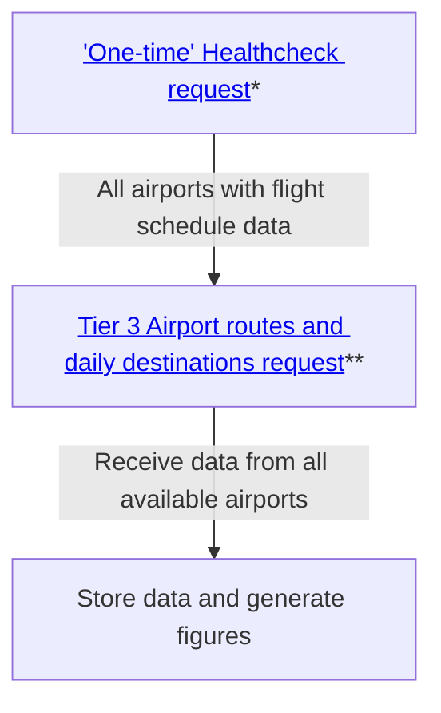

# Air Travel Demand Map

## API Access

### AeroDataBox

🌐 [Academic/Student Access Page](https://aerodatabox.com/students/) \
🌐 [RapidAPI](https://rapidapi.com/hub)

> [!NOTE]
> 50k requests to [Tier 3](https://rapidapi.com/aedbx-aedbx/api/aerodatabox/pricing) has been granted to us for academic use.

We are looking to extract the flight schedule data from all possible airports. This includes where flights are going and how many flights a day occur in all those directions.


[*] Input: What data feed is required, in this case: FlightSchedules  
Returns: List of airports (ICAO-codes) that support flight schedules data  

[**] Input: ICAO codes  
Returns: All routes and the amount of flights on those routes for the moment of time from which the data is requested. One airport = one request. This often includes aircraft type. _Note: One request returns statistics based on 7 days prior to the date specified_

A case could be made to use the [FIDS - by local time range](https://doc.aerodatabox.com/#tag/Flight-API/operation/GetAirportFlights) request. 
Input: ICAO code  
Returns: The list of arriving and/or departing flights scheduled and/or planned and/or commenced within a specified time range for a specified airport.

Depending on the number of airports the dataset might be expanded from just one week in summer and one in winter to a broader range.
Airplane data can be received via the 

## Figures

You can plot the [`matplotlib`](https://matplotlib.org) figures in the `figures` directory after installing the `plotting` Conda environment from the provided `environment.yml` file:

```bash
conda env create -f figures/environment.yml
conda activate plotting
```