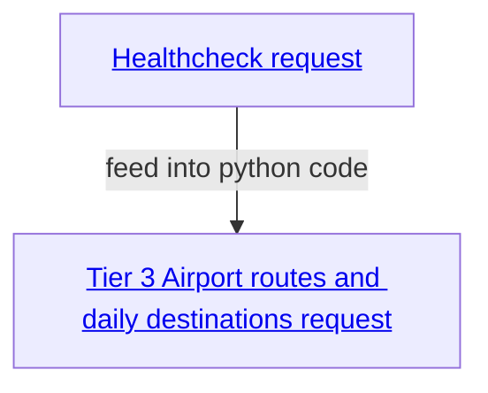

# Air Travel Demand Map

## API Access

### AeroDataBox

🌐 [Academic/Student Access Page](https://aerodatabox.com/students/) \
🌐 [RapidAPI](https://rapidapi.com/hub)

> [!NOTE]
> 50k requests to [Tier 3](https://rapidapi.com/aedbx-aedbx/api/aerodatabox/pricing) has been granted to us for academic use.

We are looking to extract the flight schedule data from all possible airports. This includes where flights are going from what airport and how many flights a day occur in all those directions.


[1] Input: What data feed is required, in this case: FlightSchedules
Returns: List of airports (ICAO-codes) that support flight schedules data

[2] Input: ICAO codes
Returns: The all routes and the amount of flights on those routes for the moment of time from which the data is requested. One airport = one request. _Note: One request returns statistics based on 7 days prior to the date specified_

## Figures

You can plot the [`matplotlib`](https://matplotlib.org) figures in the `figures` directory after installing the `plotting` Conda environment from the provided `environment.yml` file:

```bash
conda env create -f figures/environment.yml
conda activate plotting
```